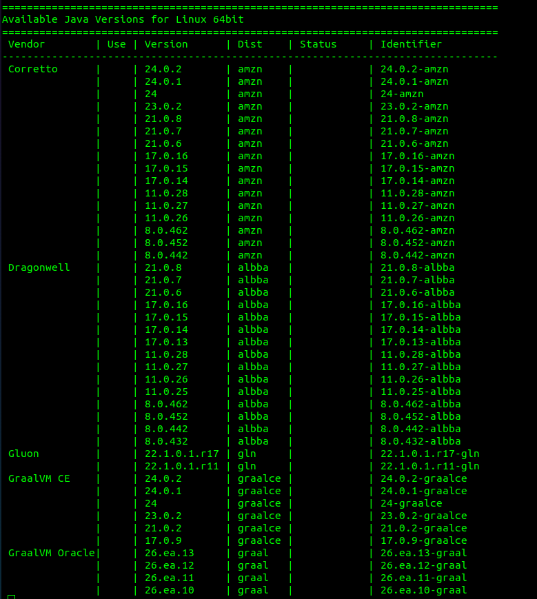

# Managing Different Java versions with SDKMAN!


<p align="center">Photo by Kevin Ku on Unsplash</p>


Imagine working on one or multiple java projects on the same machine, each requiring a different Java version. Typically, you would need to manually download installers for each JDK, extract them and update the environment variables to point to the version that you want to use. That’s where SDKMAN! comes to the rescue.

SDKMAN! is a CLI tool that removes the hassle of managing multiple versions of software development kits, allowing you to effortlessly switch between them with a single command. It works on Linux, macOS, and Windows Subsystem for Linux (WSL) on Windows (but not natively on Windows).
The name actually stands for Software Development Kit Manager. It’s not limited to Java, it’s designed primarily for JVM-related SDKs, across different categories ranging from languages to build tools and frameworks:

### Languages:
- Java
- Kotlin
- Scala
- Groovy

### build tools:
- Maven
- Gradle
- Ant

### Even frameworks like:
- Spring Boot
- Micronaut
- Quarkus

You can run the following command to get the list of all available candidates (SDKs and tools) that SDKMAN! can manage:

```bash
sdk list
```

In this article, however, we’re only going to focus on using SDKMAN! to manage multiple Java versions on the same machine.

<p align="center">*******</p>

### Installing SDKMAN!
Let’s install SDKMAN!:

Run the following curl in the terminal:

```bash
curl -s "https://get.sdkman.io" | bash
```

Once it’s installed, open a new terminal window and verify if the installation was successful:

```bash
sdk version
```

You should see output containing the version:

```bash
SDKMAN!
script: 5.20.0
native: 0.7.4 (linux x86_64)
```

<p align="center">*******</p>

### Installing Java
Once you have SDKMAN! up and running, you can use it to install a new Java version:

- First, let’s pick the Java version. If you run the following command:

    ```bash
    sdk list java
    ```
  
  you’ll see a structured list of Java distributions organized by vendor, such as:
  - Eclipse Temurin
  - Amazon Corretto
  - Oracle JDK
  - OpenJDK builds
  - Azul Zulu

  Here’s a peek at the very long list:
    

  Each entry has an **identifier**. This is a combination of the version and vendor, which you will use to install the desired version.<br></br>

- To install a specific version of Java, run the following command:
  
  ```bash
  sdk install java [Identifier]
  ```
  
  for example, to install java 17 from Eclipse, run:

  ```bash
  sdk install java 17.0.10-tem
  ```

  If you run sdk list java again, you’ll see the version you installed marked with `>>>` in the `Use` column, indicating it’s the active version in your system.<br></br>

- To switch to the installed version temporarily (for the current terminal session only), simply run:

  ```bash
  sdk use java 17.0.10-tem
  ```
  
  To set this version as the default:

  ```bash
  sdk default java 17.0.10-tem
  ```
<p align="center">*******</p>

And that’s it. Once you have multiple versions installed, a simple `sdk use` or `sdk default` as the above will save you the time and hassle.

